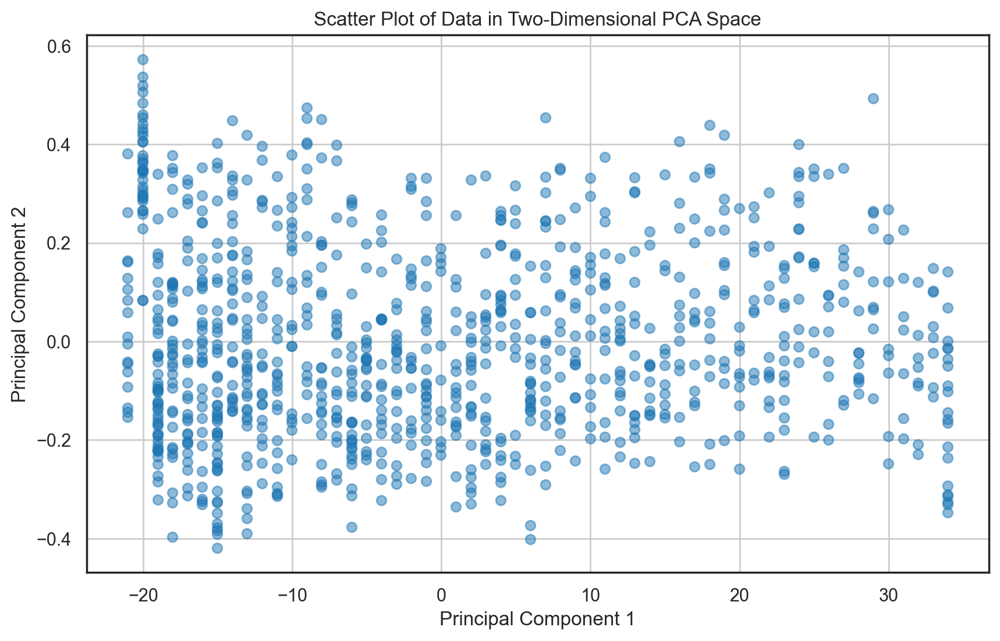

# Heart Disease Prediction | COGS 118B - Final Project
Denny Yoo, Jeffrey Yang, Yash Pakti, Samantha Prestrelski, Fayaz Shaik

## Contents
- [Abstract](#abstract)
- [Background](#background)
- [Problem Statement](#problem-statement)
- [Data](#data)
- [Proposed Solution](#proposed-solution)
  * [Evaluation Metrics](#evaluation-metrics)
- [Results](#results)
  * [Models](#models)
  * [Principal Component Analysis](#principal-component-analysis)
- [Discussion](#discussion)
  * [Interpreting the Result](#interpreting-the-result)
  * [Project Limitations](#limitations)
  * [Ethics and Privacy](#ethics--privacy)
- [Conclusion](#conclusion)

## Abstract

According to the Centers for Disease Control and Prevention (CDC), heart disease is the leading cause of death in the United States <a name="cite_ref-5"></a>[<sup>5</sup>](#cite_note-5). Although we know some of the causes of heart disease, there is no concrete formula for determining whether a person has heart disease. However, based on commonalities in people's health, we hope to use machine learning to predict which people may be at higher risk for heart disease. Early identification can help inform lifestyle choices and decrease this risk.

Our dataset comes from annual telephone surveys conducted by the CDC as part of the Behavioral Risk Factor Surveillance System (BRFSS), where each row represents a different person and each column is a health factor that might play a part an individual having heart disease. We used K-means, Gaussian Mixture Models, and hierarchical clustering which achieved maximum silhouette scores of 0.32, 0.29, and 0.63 respectively after principal component analysis for dimensionality reduction. Our hierarchical clustering method performed the best in producing the most cohesive clusters.

## Background

Heart disease affects millions of people each year and is a leading cause of mortality worldwide. The early prediction and diagnosis of heart disease is crucial for early intervention, improved treatment, and better patient outcomes. It is thus critical that medical practitioners have access to tools that would grant them the ability to make such early detections of heart disease in patients, a challenge that our project seeks to address.

As our model utilizes various health factors in its prediction of heart disease, it is crucial to understand how these factors influence the probability of an individual having heart disease. Extensive prior research exists which meticulously analyzes how factors such as BMI and age contribute to the likelihood of heart disease, illuminating the complex relationships that our model seeks to capture. A 2021 study by the American Heart Association found that obesity, as quantified by BMI, is directly responsible for a range of cardiovascular risk factors such as diabetes and hypertension which heavily contribute to an increased likelihood of heart disease <a name="cite_ref-1"></a>[<sup>1</sup>](#cite_note-1). A WebMD article corroborates that individuals past the age of 65 are drastically more susceptible to heart failure and other conditions that are linked to heart disease <a name="cite_ref-2"></a>[<sup>2</sup>](#cite_note-2). Due to their high impact nature, it is clearly imperative that BMI and age, along with the other 15 health factors, be integrated into our model should we want to comprehensively predict heart disease in patients.

Past research has also shown machine learning models to be excellent predictors of medical conditions like heart disease. A 2023 study found various neural network models to be capable of achieving up to 94.78% accuracy in heart disease prediction <a name="cite_ref-3"></a>[<sup>3</sup>](#cite_note-3). Due to the past success of these models, it becomes increasingly clear that machine learning algorithms are best fitted towards solving our problem of predicting heart disease. 


## Problem Statement

> Given our dataset with various factors relating to a patient, can we utilize unsupervised machine learning methods to identify distinct clusters or patterns that may correlate to their risk of heart disease? Can we find the unsupervised model and set of hyperparameters that corresponds best to our data?

According to the CDC, about half of all Americans (47%) have at least 1 of 3 key risk factors for heart disease: high blood pressure, high cholesterol, and smoking <a name="cite_ref-4"></a>[<sup>4</sup>](#cite_note-4). Thus, our problem affects a huge population. Fortunately, heart disease is treatable and chances of it being treated are far better if prevented early on.

Our problem statement centers around a comprehensive analysis of our heart disease data using unsupervised machine learning methods in order to identify any underlying patterns within it. The insights gained from this project may be used in future research and the development of a predictive model using supervised methods.

The problem is quantifiable as we are able to express the identification of patterns within the data as the clusters produced by the K-means, GMM, and Hierarchical clustering algorithms. These clusters may also be plotted and visualized. We are also able to quantify the final hyperparameter values we settle on, along with the number of principal components used in PCA.

The problem is measurable as we are able to measure model performance using metrics such as silhouette scores and sum of square distances. This allows us to quantifiably measure whether one model is better than another, and ultimately settle on a best-fitting one. 

Finally, this problem is replicable as our dataset and other ML training methods are publicly available. That way, others can reproduce our methods both with our dataset and others to verify our results. Our models can also be retrained later with updated data.

We will discuss the ML models further in the Proposed Solution section, but we will use different unsupervised clustering methods including hierarchical clustering, K-means, and Gaussian Mixture Models to attempt to find patterns in the data.


## Data

To investigate this question, we searched for a dataset that included information about which individuals had heart disease and traits that could possibly cause it. Our dataset, available on [Kaggle](https://www.kaggle.com/datasets/kamilpytlak/personal-key-indicators-of-heart-disease) was sourced from a 2022 annual CDC survey of over 400,000 adults on their health status. We will use 37 of the variables provided to predict heart disease, including the following:
> SleepHours, RemovedTeeth, HadHeartAttack, HadAngina, HadStroke, HadAsthma, HadSkinCancer, HadCOPD, HadDepressiveDisorder, HadKidneyDisease, HadArthritis, HadDiabetes, DeafOrHardOfHearing, BlindOrVisionDifficulty,DifficultyConcentrating, DifficultyWalking,DifficultyDressingBathing, DifficultyErrands, SmokerStatus,ECigaretteUsage, ChestScan, RaceEthnicityCategory, AgeCategory, HeightInMeters, WeightInKilograms, BMI, AlcoholDrinkers, HIVTesting, FluVaxLast12, PneumoVaxEver, TetanusLast10Tdap,HighRiskLastYear, CovidPos

Our dataset contains 320,000 observations, where each observation is a U.S. resident that provided their health status as part of the Behavioral Risk Factor Surveillance System (BRFSS)'s telephone surveys.

According to the [CDC](https://www.cdc.gov/heartdisease/risk_factors.htm) <a name="cite_ref-4"></a>[<sup>4</sup>](#cite_note-4), 
> About half of all Americans (47%) have at least 1 of 3 key risk factors for heart disease: high blood pressure, high cholesterol, and smoking.

Although high blood pressure and high cholesterol are hard to measure, diabetes and obesity are indicators of high blood pressure, making `BMI`, `Diabetic`, and `PhysicalActivity` critical variables, as well as `SmokerStatus`. BMI is numerical, Diabetic is Yes/No/Other, PhysicalActivity is Yes/No, and SmokerStatus has a few categories. The categorical variables and their answers corresponded to the [following questions](https://github.com/kamilpytlak/data-science-projects/blob/main/heart-disease-prediction/2022/documentation/vars_list_with_descriptions.tx)
> DIABETE4 - (Ever told) (you had) diabetes?  
> EXERANY2 - During the past month, other than your regular job, did you participate in any physical activities or exercises such as running, calisthenics, golf, gardening, or walking for exercise?  
> SMOKER3 - Four-level smoker status:  Everyday smoker, Someday smoker, Former smoker, Non-smoker

From data exploration in the Models notebook, we know that the original dataset provided had no null values. We have upwards of 200k different values and 40 different columns to work with, and identified different unique values for columns with data containing words, strings, and categories. We also identified the distributions of the data containing numerical values. 

<details>
  <summary>Data cleaning and exploration</summary>

```python
import numpy as np 
import pandas as pd
import matplotlib.pyplot as plt 
from sklearn.preprocessing import LabelEncoder

path_to_data = "heart_2022_no_nans.csv"
heart_2022 = pd.read_csv(path_to_data)
heart_2022.head()
```


<div>
<style scoped>
    .dataframe tbody tr th:only-of-type {
        vertical-align: middle;
    }

    .dataframe tbody tr th {
        vertical-align: top;
    }

    .dataframe thead th {
        text-align: right;
    }
</style>
<table border="1" class="dataframe">
  <thead>
    <tr style="text-align: right;">
      <th></th>
      <th>State</th>
      <th>Sex</th>
      <th>GeneralHealth</th>
      <th>PhysicalHealthDays</th>
      <th>MentalHealthDays</th>
      <th>LastCheckupTime</th>
      <th>PhysicalActivities</th>
      <th>SleepHours</th>
      <th>RemovedTeeth</th>
      <th>HadHeartAttack</th>
      <th>...</th>
      <th>HeightInMeters</th>
      <th>WeightInKilograms</th>
      <th>BMI</th>
      <th>AlcoholDrinkers</th>
      <th>HIVTesting</th>
      <th>FluVaxLast12</th>
      <th>PneumoVaxEver</th>
      <th>TetanusLast10Tdap</th>
      <th>HighRiskLastYear</th>
      <th>CovidPos</th>
    </tr>
  </thead>
  <tbody>
    <tr>
      <th>0</th>
      <td>Alabama</td>
      <td>Female</td>
      <td>Very good</td>
      <td>4.0</td>
      <td>0.0</td>
      <td>Within past year (anytime less than 12 months ...</td>
      <td>Yes</td>
      <td>9.0</td>
      <td>None of them</td>
      <td>No</td>
      <td>...</td>
      <td>1.60</td>
      <td>71.67</td>
      <td>27.99</td>
      <td>No</td>
      <td>No</td>
      <td>Yes</td>
      <td>Yes</td>
      <td>Yes, received Tdap</td>
      <td>No</td>
      <td>No</td>
    </tr>
    <tr>
      <th>1</th>
      <td>Alabama</td>
      <td>Male</td>
      <td>Very good</td>
      <td>0.0</td>
      <td>0.0</td>
      <td>Within past year (anytime less than 12 months ...</td>
      <td>Yes</td>
      <td>6.0</td>
      <td>None of them</td>
      <td>No</td>
      <td>...</td>
      <td>1.78</td>
      <td>95.25</td>
      <td>30.13</td>
      <td>No</td>
      <td>No</td>
      <td>Yes</td>
      <td>Yes</td>
      <td>Yes, received tetanus shot but not sure what type</td>
      <td>No</td>
      <td>No</td>
    </tr>
    <tr>
      <th>2</th>
      <td>Alabama</td>
      <td>Male</td>
      <td>Very good</td>
      <td>0.0</td>
      <td>0.0</td>
      <td>Within past year (anytime less than 12 months ...</td>
      <td>No</td>
      <td>8.0</td>
      <td>6 or more, but not all</td>
      <td>No</td>
      <td>...</td>
      <td>1.85</td>
      <td>108.86</td>
      <td>31.66</td>
      <td>Yes</td>
      <td>No</td>
      <td>No</td>
      <td>Yes</td>
      <td>No, did not receive any tetanus shot in the pa...</td>
      <td>No</td>
      <td>Yes</td>
    </tr>
    <tr>
      <th>3</th>
      <td>Alabama</td>
      <td>Female</td>
      <td>Fair</td>
      <td>5.0</td>
      <td>0.0</td>
      <td>Within past year (anytime less than 12 months ...</td>
      <td>Yes</td>
      <td>9.0</td>
      <td>None of them</td>
      <td>No</td>
      <td>...</td>
      <td>1.70</td>
      <td>90.72</td>
      <td>31.32</td>
      <td>No</td>
      <td>No</td>
      <td>Yes</td>
      <td>Yes</td>
      <td>No, did not receive any tetanus shot in the pa...</td>
      <td>No</td>
      <td>Yes</td>
    </tr>
    <tr>
      <th>4</th>
      <td>Alabama</td>
      <td>Female</td>
      <td>Good</td>
      <td>3.0</td>
      <td>15.0</td>
      <td>Within past year (anytime less than 12 months ...</td>
      <td>Yes</td>
      <td>5.0</td>
      <td>1 to 5</td>
      <td>No</td>
      <td>...</td>
      <td>1.55</td>
      <td>79.38</td>
      <td>33.07</td>
      <td>No</td>
      <td>No</td>
      <td>Yes</td>
      <td>Yes</td>
      <td>No, did not receive any tetanus shot in the pa...</td>
      <td>No</td>
      <td>No</td>
    </tr>
  </tbody>
</table>
<p>5 rows × 40 columns</p>
</div>


We will scale float-based columns to between 0 and 1 to normalize them. We will also one-hot encode the categorical columns, sufficiently vectorizing the data and allowing us to do classification and analysis to predict what factors affect heart disease in patients. 


```python
# scale float-based columns to between 0 and 1
numerical_cols = heart_2022.select_dtypes(include=['float']).columns
print(f'Numerical Columns: {list(numerical_cols)}')
for col in numerical_cols:
    heart_2022[col] = heart_2022[col]/heart_2022[col].max()

# one-hot encode categorical columns
category_cols = heart_2022.select_dtypes(include=['O']).columns
print(f'Categorical Columns {list(category_cols)}')
# for binary columns
binary_cols = [col for col in category_cols if heart_2022[col].nunique() == 2]
for col in binary_cols:
    le = LabelEncoder()
    heart_2022[col] = le.fit_transform(heart_2022[col])

# for columns with more than two unique values
multiple_cols = [col for col in category_cols if heart_2022[col].nunique() != 2]
df = pd.get_dummies(heart_2022, columns=multiple_cols, prefix=multiple_cols)
df.to_csv("heart_2022_cleaned.csv")

df_noindic = df.drop(columns=["HadHeartAttack", "HadAngina", "HadStroke"])
df_noindic.head()
```

    Numerical Columns: ['PhysicalHealthDays', 'MentalHealthDays', 'SleepHours', 'HeightInMeters', 'WeightInKilograms', 'BMI']
    Categorical Columns ['State', 'Sex', 'GeneralHealth', 'LastCheckupTime', 'PhysicalActivities', 'RemovedTeeth', 'HadHeartAttack', 'HadAngina', 'HadStroke', 'HadAsthma', 'HadSkinCancer', 'HadCOPD', 'HadDepressiveDisorder', 'HadKidneyDisease', 'HadArthritis', 'HadDiabetes', 'DeafOrHardOfHearing', 'BlindOrVisionDifficulty', 'DifficultyConcentrating', 'DifficultyWalking', 'DifficultyDressingBathing', 'DifficultyErrands', 'SmokerStatus', 'ECigaretteUsage', 'ChestScan', 'RaceEthnicityCategory', 'AgeCategory', 'AlcoholDrinkers', 'HIVTesting', 'FluVaxLast12', 'PneumoVaxEver', 'TetanusLast10Tdap', 'HighRiskLastYear', 'CovidPos']
    


<div>
<style scoped>
    .dataframe tbody tr th:only-of-type {
        vertical-align: middle;
    }

    .dataframe tbody tr th {
        vertical-align: top;
    }

    .dataframe thead th {
        text-align: right;
    }
</style>
<table border="1" class="dataframe">
  <thead>
    <tr style="text-align: right;">
      <th></th>
      <th>Sex</th>
      <th>PhysicalHealthDays</th>
      <th>MentalHealthDays</th>
      <th>PhysicalActivities</th>
      <th>SleepHours</th>
      <th>HadAsthma</th>
      <th>HadSkinCancer</th>
      <th>HadCOPD</th>
      <th>HadDepressiveDisorder</th>
      <th>HadKidneyDisease</th>
      <th>...</th>
      <th>AgeCategory_Age 70 to 74</th>
      <th>AgeCategory_Age 75 to 79</th>
      <th>AgeCategory_Age 80 or older</th>
      <th>TetanusLast10Tdap_No, did not receive any tetanus shot in the past 10 years</th>
      <th>TetanusLast10Tdap_Yes, received Tdap</th>
      <th>TetanusLast10Tdap_Yes, received tetanus shot but not sure what type</th>
      <th>TetanusLast10Tdap_Yes, received tetanus shot, but not Tdap</th>
      <th>CovidPos_No</th>
      <th>CovidPos_Tested positive using home test without a health professional</th>
      <th>CovidPos_Yes</th>
    </tr>
  </thead>
  <tbody>
    <tr>
      <th>0</th>
      <td>0</td>
      <td>0.133333</td>
      <td>0.0</td>
      <td>1</td>
      <td>0.375000</td>
      <td>0</td>
      <td>0</td>
      <td>0</td>
      <td>0</td>
      <td>0</td>
      <td>...</td>
      <td>False</td>
      <td>False</td>
      <td>False</td>
      <td>False</td>
      <td>True</td>
      <td>False</td>
      <td>False</td>
      <td>True</td>
      <td>False</td>
      <td>False</td>
    </tr>
    <tr>
      <th>1</th>
      <td>1</td>
      <td>0.000000</td>
      <td>0.0</td>
      <td>1</td>
      <td>0.250000</td>
      <td>0</td>
      <td>0</td>
      <td>0</td>
      <td>0</td>
      <td>0</td>
      <td>...</td>
      <td>True</td>
      <td>False</td>
      <td>False</td>
      <td>False</td>
      <td>False</td>
      <td>True</td>
      <td>False</td>
      <td>True</td>
      <td>False</td>
      <td>False</td>
    </tr>
    <tr>
      <th>2</th>
      <td>1</td>
      <td>0.000000</td>
      <td>0.0</td>
      <td>0</td>
      <td>0.333333</td>
      <td>0</td>
      <td>0</td>
      <td>0</td>
      <td>0</td>
      <td>0</td>
      <td>...</td>
      <td>False</td>
      <td>True</td>
      <td>False</td>
      <td>True</td>
      <td>False</td>
      <td>False</td>
      <td>False</td>
      <td>False</td>
      <td>False</td>
      <td>True</td>
    </tr>
    <tr>
      <th>3</th>
      <td>0</td>
      <td>0.166667</td>
      <td>0.0</td>
      <td>1</td>
      <td>0.375000</td>
      <td>0</td>
      <td>1</td>
      <td>0</td>
      <td>1</td>
      <td>0</td>
      <td>...</td>
      <td>False</td>
      <td>False</td>
      <td>True</td>
      <td>True</td>
      <td>False</td>
      <td>False</td>
      <td>False</td>
      <td>False</td>
      <td>False</td>
      <td>True</td>
    </tr>
    <tr>
      <th>4</th>
      <td>0</td>
      <td>0.100000</td>
      <td>0.5</td>
      <td>1</td>
      <td>0.208333</td>
      <td>0</td>
      <td>0</td>
      <td>0</td>
      <td>0</td>
      <td>0</td>
      <td>...</td>
      <td>False</td>
      <td>False</td>
      <td>True</td>
      <td>True</td>
      <td>False</td>
      <td>False</td>
      <td>False</td>
      <td>True</td>
      <td>False</td>
      <td>False</td>
    </tr>
  </tbody>
</table>
<p>5 rows × 130 columns</p>
</div>

</details>

## Proposed Solution

To address our problem, we will compare the performance of different techniques of unsupervised learning methods learned in class. This includes methods such as K-means, Gaussian Mixture Models, and Hierarchical clustering. 

Due to the large size of the data file, we will select an initial random sample of size 1000. This sample will be fitted, before and after running PCA, to the three main clustering algorithms, K-means, Gaussian Mixture Models, and Hierarchical clustering, with varying hyperparameter values. We will then use silhouette scores to test model performance in order to fine tune the most optimal hyperparameter values for each model and to ultimately find the best performing model for our data.

Although traits like high blood pressure, high cholesterol, and smoking are known to be risk factors for heart disease, we are unsure of their predictive value compared to other traits in the dataset, since there is no simple equation for heart disease. Clustering algorithms are suitable for identifying underlying structures and groupings within the unlabeled data. Thus, these unsupervised learning methods will be effective in helping us see if there are any trends in the data of people with similar traits. 

Since there are 37 predicting variables for a binary value, and 130 health factors (columns) in total, dimensionality reduction with Principal Component Analysis will help mitigate the curse of dimensionality by focusing on the few components that capture the maximum variance. This may aid in helping us identify patterns within our data as we rerun our models.

Thus, our solution of utilizing unsupervised learning models and principal component analysis is appropriate in finding patterns within patient data about heart disease. Furthermore, our results will be reproducible through the use of the identical random_state seed when running our models and random samples.

We will do all work in Jupyter notebooks using publicly available models and datasets, as well as provide links to any resources used so that our work is reproducible.


### Evaluation Metrics

We will use silhouette score to evaluate our models. Silhouette score takes into account the distances between the points of one cluster and the nearest cluster center. The function for silhouette score can be generalized as such:

$$\frac{separation - cohesion}{max(separation, cohesion)}$$

This metric can be used to determine the optimal number of clusters for our data as certain factors could lead to specific kinds of heart disease, or we can see if there is great overlap between them with a smaller number of clusters. This metric works across all of our unsupervised clustering methods and allows us to directly compare the performance of multiple models, rather than having to interpret multiple metrics.

Another metric that we will use is sum of squared distances or SSD. SSD measures how compact each cluster is by calculating the sum of squared distances between each datapoint and the centroid of its cluster. The formula is given as such:
$$SSD = \sum_{i=1}^{n} (x_i - \mu)^2$$
This metric is typically used in tandem with silhouette score or the elbow method in order to determine the number of clusters that should be used for the model.

## Results

### Models
<!-- ### Hierarchical Clustering -->
<details>
 <summary>Hierarchical Clustering</summary>

```python
from scipy.cluster.hierarchy import fcluster
from numpy.linalg import norm
from scipy.cluster.hierarchy import linkage, dendrogram, fcluster
from sklearn.cluster import AgglomerativeClustering
from sklearn.preprocessing import StandardScaler, normalize
from sklearn.metrics import silhouette_score

import seaborn as sns

# setup plotting in a notebook in a reasonable way
%matplotlib inline
%config InlineBackend.figure_format='retina'

# default figure aesthetics I'll be using, 
# there are other choices, see seaborn docs
sns.set_style("white")
sns.set_context("notebook")
```


```python
# We take a random sample of size 5000 of our data
sampled_heart_2022 = df_noindic.sample(n=1000, random_state = 42)
sampled_heart_2022
```


<div>
<style scoped>
    .dataframe tbody tr th:only-of-type {
        vertical-align: middle;
    }

    .dataframe tbody tr th {
        vertical-align: top;
    }

    .dataframe thead th {
        text-align: right;
    }
</style>
<table border="1" class="dataframe">
  <thead>
    <tr style="text-align: right;">
      <th></th>
      <th>Sex</th>
      <th>PhysicalHealthDays</th>
      <th>MentalHealthDays</th>
      <th>PhysicalActivities</th>
      <th>SleepHours</th>
      <th>HadAsthma</th>
      <th>HadSkinCancer</th>
      <th>HadCOPD</th>
      <th>HadDepressiveDisorder</th>
      <th>HadKidneyDisease</th>
      <th>...</th>
      <th>AgeCategory_Age 70 to 74</th>
      <th>AgeCategory_Age 75 to 79</th>
      <th>AgeCategory_Age 80 or older</th>
      <th>TetanusLast10Tdap_No, did not receive any tetanus shot in the past 10 years</th>
      <th>TetanusLast10Tdap_Yes, received Tdap</th>
      <th>TetanusLast10Tdap_Yes, received tetanus shot but not sure what type</th>
      <th>TetanusLast10Tdap_Yes, received tetanus shot, but not Tdap</th>
      <th>CovidPos_No</th>
      <th>CovidPos_Tested positive using home test without a health professional</th>
      <th>CovidPos_Yes</th>
    </tr>
  </thead>
  <tbody>
    <tr>
      <th>194767</th>
      <td>0</td>
      <td>0.000000</td>
      <td>0.000000</td>
      <td>1</td>
      <td>0.333333</td>
      <td>0</td>
      <td>0</td>
      <td>0</td>
      <td>0</td>
      <td>0</td>
      <td>...</td>
      <td>False</td>
      <td>False</td>
      <td>False</td>
      <td>True</td>
      <td>False</td>
      <td>False</td>
      <td>False</td>
      <td>False</td>
      <td>False</td>
      <td>True</td>
    </tr>
    <tr>
      <th>231923</th>
      <td>0</td>
      <td>0.066667</td>
      <td>0.166667</td>
      <td>1</td>
      <td>0.333333</td>
      <td>1</td>
      <td>0</td>
      <td>0</td>
      <td>0</td>
      <td>0</td>
      <td>...</td>
      <td>False</td>
      <td>False</td>
      <td>False</td>
      <td>True</td>
      <td>False</td>
      <td>False</td>
      <td>False</td>
      <td>True</td>
      <td>False</td>
      <td>False</td>
    </tr>
    <tr>
      <th>52815</th>
      <td>1</td>
      <td>0.233333</td>
      <td>0.333333</td>
      <td>1</td>
      <td>0.250000</td>
      <td>1</td>
      <td>0</td>
      <td>0</td>
      <td>0</td>
      <td>0</td>
      <td>...</td>
      <td>False</td>
      <td>False</td>
      <td>False</td>
      <td>False</td>
      <td>False</td>
      <td>True</td>
      <td>False</td>
      <td>True</td>
      <td>False</td>
      <td>False</td>
    </tr>
    <tr>
      <th>65909</th>
      <td>0</td>
      <td>0.666667</td>
      <td>0.333333</td>
      <td>0</td>
      <td>0.333333</td>
      <td>0</td>
      <td>0</td>
      <td>1</td>
      <td>1</td>
      <td>1</td>
      <td>...</td>
      <td>False</td>
      <td>False</td>
      <td>False</td>
      <td>True</td>
      <td>False</td>
      <td>False</td>
      <td>False</td>
      <td>False</td>
      <td>False</td>
      <td>True</td>
    </tr>
    <tr>
      <th>184154</th>
      <td>0</td>
      <td>0.000000</td>
      <td>0.000000</td>
      <td>1</td>
      <td>0.291667</td>
      <td>0</td>
      <td>0</td>
      <td>0</td>
      <td>0</td>
      <td>0</td>
      <td>...</td>
      <td>False</td>
      <td>False</td>
      <td>False</td>
      <td>False</td>
      <td>True</td>
      <td>False</td>
      <td>False</td>
      <td>False</td>
      <td>True</td>
      <td>False</td>
    </tr>
    <tr>
      <th>...</th>
      <td>...</td>
      <td>...</td>
      <td>...</td>
      <td>...</td>
      <td>...</td>
      <td>...</td>
      <td>...</td>
      <td>...</td>
      <td>...</td>
      <td>...</td>
      <td>...</td>
      <td>...</td>
      <td>...</td>
      <td>...</td>
      <td>...</td>
      <td>...</td>
      <td>...</td>
      <td>...</td>
      <td>...</td>
      <td>...</td>
      <td>...</td>
    </tr>
    <tr>
      <th>225991</th>
      <td>0</td>
      <td>0.000000</td>
      <td>1.000000</td>
      <td>1</td>
      <td>0.375000</td>
      <td>1</td>
      <td>0</td>
      <td>0</td>
      <td>0</td>
      <td>0</td>
      <td>...</td>
      <td>False</td>
      <td>False</td>
      <td>False</td>
      <td>False</td>
      <td>True</td>
      <td>False</td>
      <td>False</td>
      <td>False</td>
      <td>True</td>
      <td>False</td>
    </tr>
    <tr>
      <th>17905</th>
      <td>0</td>
      <td>1.000000</td>
      <td>0.166667</td>
      <td>0</td>
      <td>0.166667</td>
      <td>1</td>
      <td>1</td>
      <td>0</td>
      <td>1</td>
      <td>0</td>
      <td>...</td>
      <td>False</td>
      <td>False</td>
      <td>False</td>
      <td>False</td>
      <td>True</td>
      <td>False</td>
      <td>False</td>
      <td>False</td>
      <td>False</td>
      <td>True</td>
    </tr>
    <tr>
      <th>68078</th>
      <td>0</td>
      <td>0.100000</td>
      <td>0.000000</td>
      <td>1</td>
      <td>0.291667</td>
      <td>0</td>
      <td>0</td>
      <td>0</td>
      <td>0</td>
      <td>0</td>
      <td>...</td>
      <td>True</td>
      <td>False</td>
      <td>False</td>
      <td>False</td>
      <td>True</td>
      <td>False</td>
      <td>False</td>
      <td>True</td>
      <td>False</td>
      <td>False</td>
    </tr>
    <tr>
      <th>39514</th>
      <td>0</td>
      <td>0.000000</td>
      <td>0.333333</td>
      <td>1</td>
      <td>0.416667</td>
      <td>1</td>
      <td>0</td>
      <td>0</td>
      <td>0</td>
      <td>0</td>
      <td>...</td>
      <td>True</td>
      <td>False</td>
      <td>False</td>
      <td>True</td>
      <td>False</td>
      <td>False</td>
      <td>False</td>
      <td>False</td>
      <td>False</td>
      <td>True</td>
    </tr>
    <tr>
      <th>161690</th>
      <td>1</td>
      <td>0.000000</td>
      <td>0.000000</td>
      <td>0</td>
      <td>0.250000</td>
      <td>0</td>
      <td>0</td>
      <td>0</td>
      <td>0</td>
      <td>0</td>
      <td>...</td>
      <td>False</td>
      <td>False</td>
      <td>False</td>
      <td>True</td>
      <td>False</td>
      <td>False</td>
      <td>False</td>
      <td>True</td>
      <td>False</td>
      <td>False</td>
    </tr>
  </tbody>
</table>
<p>1000 rows × 130 columns</p>
</div>


Due to the size of our dataset, we've selected a sample of 1000 data points. We believe that this sample size is large enough for us to get a representative view of the dataset while also compromising for our ability to run the models. 


```python
# Standardize data
scaler = StandardScaler() 
scaled_df = scaler.fit_transform(sampled_heart_2022) 
  
# Normalizing the Data 
normalized_df = normalize(scaled_df) 
  
# Converting the numpy array into a pandas DataFrame 
normalized_df = pd.DataFrame(normalized_df)
normalized_df.columns = df_noindic.columns
normalized_df
```


<div>
<style scoped>
    .dataframe tbody tr th:only-of-type {
        vertical-align: middle;
    }

    .dataframe tbody tr th {
        vertical-align: top;
    }

    .dataframe thead th {
        text-align: right;
    }
</style>
<table border="1" class="dataframe">
  <thead>
    <tr style="text-align: right;">
      <th></th>
      <th>Sex</th>
      <th>PhysicalHealthDays</th>
      <th>MentalHealthDays</th>
      <th>PhysicalActivities</th>
      <th>SleepHours</th>
      <th>HadAsthma</th>
      <th>HadSkinCancer</th>
      <th>HadCOPD</th>
      <th>HadDepressiveDisorder</th>
      <th>HadKidneyDisease</th>
      <th>...</th>
      <th>AgeCategory_Age 70 to 74</th>
      <th>AgeCategory_Age 75 to 79</th>
      <th>AgeCategory_Age 80 or older</th>
      <th>TetanusLast10Tdap_No, did not receive any tetanus shot in the past 10 years</th>
      <th>TetanusLast10Tdap_Yes, received Tdap</th>
      <th>TetanusLast10Tdap_Yes, received tetanus shot but not sure what type</th>
      <th>TetanusLast10Tdap_Yes, received tetanus shot, but not Tdap</th>
      <th>CovidPos_No</th>
      <th>CovidPos_Tested positive using home test without a health professional</th>
      <th>CovidPos_Yes</th>
    </tr>
  </thead>
  <tbody>
    <tr>
      <th>0</th>
      <td>-0.083719</td>
      <td>-0.046465</td>
      <td>-0.049926</td>
      <td>0.048645</td>
      <td>0.061793</td>
      <td>-0.039979</td>
      <td>-0.031355</td>
      <td>-0.028670</td>
      <td>-0.048352</td>
      <td>-0.020890</td>
      <td>...</td>
      <td>-0.034571</td>
      <td>-0.028300</td>
      <td>-0.023341</td>
      <td>0.135255</td>
      <td>-0.060410</td>
      <td>-0.062462</td>
      <td>-0.026978</td>
      <td>-0.141661</td>
      <td>-0.017377</td>
      <td>0.153503</td>
    </tr>
    <tr>
      <th>1</th>
      <td>-0.098300</td>
      <td>-0.029668</td>
      <td>0.008359</td>
      <td>0.057117</td>
      <td>0.072555</td>
      <td>0.259870</td>
      <td>-0.036816</td>
      <td>-0.033664</td>
      <td>-0.056773</td>
      <td>-0.024528</td>
      <td>...</td>
      <td>-0.040593</td>
      <td>-0.033229</td>
      <td>-0.027406</td>
      <td>0.158811</td>
      <td>-0.070931</td>
      <td>-0.073340</td>
      <td>-0.031676</td>
      <td>0.073340</td>
      <td>-0.020403</td>
      <td>-0.067682</td>
    </tr>
    <tr>
      <th>2</th>
      <td>0.086232</td>
      <td>0.022622</td>
      <td>0.052351</td>
      <td>0.039688</td>
      <td>-0.058946</td>
      <td>0.180575</td>
      <td>-0.025582</td>
      <td>-0.023392</td>
      <td>-0.039450</td>
      <td>-0.017044</td>
      <td>...</td>
      <td>-0.028206</td>
      <td>-0.023090</td>
      <td>-0.019044</td>
      <td>-0.053375</td>
      <td>-0.049287</td>
      <td>0.115579</td>
      <td>-0.022011</td>
      <td>0.050962</td>
      <td>-0.014178</td>
      <td>-0.047030</td>
    </tr>
    <tr>
      <th>3</th>
      <td>-0.069461</td>
      <td>0.137323</td>
      <td>0.053237</td>
      <td>-0.150920</td>
      <td>0.051269</td>
      <td>-0.033171</td>
      <td>-0.026015</td>
      <td>0.256066</td>
      <td>0.151833</td>
      <td>0.351437</td>
      <td>...</td>
      <td>-0.028684</td>
      <td>-0.023480</td>
      <td>-0.019366</td>
      <td>0.112220</td>
      <td>-0.050122</td>
      <td>-0.051824</td>
      <td>-0.022383</td>
      <td>-0.117536</td>
      <td>-0.014418</td>
      <td>0.127361</td>
    </tr>
    <tr>
      <th>4</th>
      <td>-0.074060</td>
      <td>-0.041104</td>
      <td>-0.044166</td>
      <td>0.043032</td>
      <td>-0.004624</td>
      <td>-0.035367</td>
      <td>-0.027738</td>
      <td>-0.025362</td>
      <td>-0.042773</td>
      <td>-0.018480</td>
      <td>...</td>
      <td>-0.030583</td>
      <td>-0.025035</td>
      <td>-0.020648</td>
      <td>-0.057872</td>
      <td>0.129573</td>
      <td>-0.055255</td>
      <td>-0.023865</td>
      <td>-0.125316</td>
      <td>0.450448</td>
      <td>-0.050992</td>
    </tr>
    <tr>
      <th>...</th>
      <td>...</td>
      <td>...</td>
      <td>...</td>
      <td>...</td>
      <td>...</td>
      <td>...</td>
      <td>...</td>
      <td>...</td>
      <td>...</td>
      <td>...</td>
      <td>...</td>
      <td>...</td>
      <td>...</td>
      <td>...</td>
      <td>...</td>
      <td>...</td>
      <td>...</td>
      <td>...</td>
      <td>...</td>
      <td>...</td>
      <td>...</td>
    </tr>
    <tr>
      <th>995</th>
      <td>-0.076666</td>
      <td>-0.042550</td>
      <td>0.267716</td>
      <td>0.044546</td>
      <td>0.117960</td>
      <td>0.202676</td>
      <td>-0.028713</td>
      <td>-0.026255</td>
      <td>-0.044278</td>
      <td>-0.019130</td>
      <td>...</td>
      <td>-0.031659</td>
      <td>-0.025916</td>
      <td>-0.021374</td>
      <td>-0.059908</td>
      <td>0.134132</td>
      <td>-0.057199</td>
      <td>-0.024705</td>
      <td>-0.129726</td>
      <td>0.466297</td>
      <td>-0.052786</td>
    </tr>
    <tr>
      <th>996</th>
      <td>-0.069089</td>
      <td>0.224052</td>
      <td>0.005875</td>
      <td>-0.150111</td>
      <td>-0.170239</td>
      <td>0.182646</td>
      <td>0.232882</td>
      <td>-0.023660</td>
      <td>0.151018</td>
      <td>-0.017239</td>
      <td>...</td>
      <td>-0.028530</td>
      <td>-0.023354</td>
      <td>-0.019262</td>
      <td>-0.053987</td>
      <td>0.120876</td>
      <td>-0.051546</td>
      <td>-0.022263</td>
      <td>-0.116905</td>
      <td>-0.014340</td>
      <td>0.126678</td>
    </tr>
    <tr>
      <th>997</th>
      <td>-0.100424</td>
      <td>-0.017596</td>
      <td>-0.059888</td>
      <td>0.058351</td>
      <td>-0.006271</td>
      <td>-0.047956</td>
      <td>-0.037612</td>
      <td>-0.034391</td>
      <td>-0.058000</td>
      <td>-0.025058</td>
      <td>...</td>
      <td>0.307014</td>
      <td>-0.033947</td>
      <td>-0.027998</td>
      <td>-0.078473</td>
      <td>0.175699</td>
      <td>-0.074925</td>
      <td>-0.032360</td>
      <td>0.074925</td>
      <td>-0.020844</td>
      <td>-0.069144</td>
    </tr>
    <tr>
      <th>998</th>
      <td>-0.103208</td>
      <td>-0.057281</td>
      <td>0.079102</td>
      <td>0.059968</td>
      <td>0.241422</td>
      <td>0.272845</td>
      <td>-0.038654</td>
      <td>-0.035344</td>
      <td>-0.059608</td>
      <td>-0.025753</td>
      <td>...</td>
      <td>0.315526</td>
      <td>-0.034888</td>
      <td>-0.028775</td>
      <td>0.166741</td>
      <td>-0.074472</td>
      <td>-0.077002</td>
      <td>-0.033258</td>
      <td>-0.174638</td>
      <td>-0.021422</td>
      <td>0.189237</td>
    </tr>
    <tr>
      <th>999</th>
      <td>0.099882</td>
      <td>-0.043911</td>
      <td>-0.047182</td>
      <td>-0.171901</td>
      <td>-0.068277</td>
      <td>-0.037782</td>
      <td>-0.029632</td>
      <td>-0.027094</td>
      <td>-0.045695</td>
      <td>-0.019742</td>
      <td>...</td>
      <td>-0.032671</td>
      <td>-0.026745</td>
      <td>-0.022058</td>
      <td>0.127821</td>
      <td>-0.057089</td>
      <td>-0.059028</td>
      <td>-0.025495</td>
      <td>0.059028</td>
      <td>-0.016422</td>
      <td>-0.054475</td>
    </tr>
  </tbody>
</table>
<p>1000 rows × 130 columns</p>
</div>


The dataset is normalized for several reasons. Hierarchical clustering relies on distance metrics thus normalizing the data can scale features that are extremely large in comparison to others. Normalizing the data also reduces the impact of outliers by ensuring the data fits within a certain range. 


```python
silhouette_scores = [] 

for n_cluster in range(2, 131):
    silhouette_scores.append( 
        silhouette_score(normalized_df, AgglomerativeClustering(n_clusters = n_cluster).fit_predict(normalized_df))) 
    
# Plotting a bar graph to compare the results 
k = [i for i in range(2, 131)] 
plt.bar(k, silhouette_scores) 
plt.xlabel('Number of clusters', fontsize = 10) 
plt.ylabel('Silhouette Score', fontsize = 10) 
plt.show()
```


    

    


```python
max_silhouette_score = max(silhouette_scores)
print(max_silhouette_score)
num_clusters = silhouette_scores.index(max_silhouette_score)
print(num_clusters)
```

    0.1981003405170722
    56
    

After running the model on every feature and 1000 samples, we get a silhouette score of 0.198 with 56 clusters. The score does not incite much confidence in our model as the score is quite low leading us to believe that the model is closer to random than having a true ability to predict if a patient has heart disease.


```python
plt.figure(1, figsize = (16 ,8))
links = linkage(normalized_df, method = "ward")
dendrogram = dendrogram(links)

plt.title('Dendrogram')
plt.xlabel('Adults')
plt.ylabel('Euclidean distances')
plt.show()
```


    

    
</details>

<!-- ### Gaussian Mixture Model -->
<details>
 <summary>Gaussian Mixture Model</summary>

We begin by running a gaussian mixture model on the cleaned data for a variety of n_component values between 2 and 10 while calculating the silhouette score for each iteration:


```python
from sklearn.mixture import GaussianMixture

gmm_scores = []

for k in range(2, 131):
    gmm = GaussianMixture(n_components = k, covariance_type = 'full', random_state = 42)
    gmm.fit(sampled_heart_2022)
    labels = gmm.predict(sampled_heart_2022)
    score = silhouette_score(sampled_heart_2022, labels)
    #print(f'Silhouette score for {k} clusters: {score}')
    gmm_scores.append(score)
```

To visualize our model performance, we plot the silhouette scores.


```python
plt.bar(range(2, 131), gmm_scores) 
plt.xlabel('Number of clusterss', fontsize = 10) 
plt.ylabel('Silhouette Score', fontsize = 10) 
plt.show()
```


    

    


The score for two clusters is greatest, suggesting that this number of clusters may be the most optimal for our data. However, all the scores are extremely low, suggesting that the clustering produced by GMM's is quite poor. This may be due to the overwhelming amount of binary columns in the data set. To address this, we repeat the process on only the numerical values of the data:


```python
sampled_heart_2022_nobin = sampled_heart_2022.select_dtypes(include=[np.float64])
gmm_scores = []

for k in range(2, 10):
    gmm = GaussianMixture(n_components = k, covariance_type = 'full', random_state = 42)
    gmm.fit(sampled_heart_2022_nobin)
    labels = gmm.predict(sampled_heart_2022_nobin)
    score = silhouette_score(sampled_heart_2022_nobin, labels)
    #print(f'Silhouette score for {k} clusters: {score}')
    gmm_scores.append(score)
    
plt.bar(range(2, 10), gmm_scores) 
plt.xlabel('Number of clusters', fontsize = 10) 
plt.ylabel('Silhouette Score', fontsize = 10) 
plt.show()

print(gmm_scores[0])
```


    

    


    0.25207779671164426
    

2 components continues to have the highest silhouette score. Addtionally, scores across the board have increased significantly. Despite this, with a max score of 0.25207779671164426, a Gaussian Mixture Model doesn't seem to be producing the best clustering for our data set.

</details>

<!-- ### K-means -->
<details>
 <summary>K-means</summary>

```python
from sklearn.cluster import KMeans
from sklearn.metrics import silhouette_score, silhouette_samples
from sklearn.preprocessing import StandardScaler, OneHotEncoder
from sklearn.decomposition import PCA
from sklearn.manifold import TSNE
from kneed import KneeLocator
from mpl_toolkits.mplot3d import Axes3D

# KMeans clustering
kmeans_scores = []

for k in range(2, 131):
    kmeans = KMeans(n_clusters=k, random_state=42, n_init=10)
    kmeans.fit(sampled_heart_2022)
    labels = kmeans.predict(sampled_heart_2022)
    score = silhouette_score(sampled_heart_2022, labels)
    kmeans_scores.append(score)
```

Let's visualize the silhouette scores for K-means.


```python
plt.bar(range(2, 131), kmeans_scores)
plt.xlabel('Number of clusters', fontsize=10)
plt.ylabel('Silhouette Score', fontsize=10)
plt.show()
print(kmeans_scores[0])
```


    

    


    0.06703969435809412
    

Similar to Gaussian Mixture Model, the Silhouette scores for K-means is very low for all clusters, with the score for 2 clusters being the highest. Therefore, let's repeat the process while using OneHot Encoding for categorical data and Scaler for the numerical data.


```python
numerical_df = sampled_heart_2022.select_dtypes(include=[np.float64])
categorical_df = sampled_heart_2022.select_dtypes(include=[object])

# Handle categorical variables (one-hot encoding)
encoder = OneHotEncoder()
encoded_categorical = pd.DataFrame(encoder.fit_transform(categorical_df).toarray())

# Standardize numerical features
scaler = StandardScaler()
scaled_numerical = scaler.fit_transform(numerical_df)

# Combine numerical and encoded categorical features
processed_df = pd.concat([pd.DataFrame(scaled_numerical), encoded_categorical], axis=1)
```

Let's PCA this data to reduce the number of features and find how much each PC affects the total variance of the data. 


```python
# Apply dimensionality reduction (PCA) with 3 components
pca = PCA(n_components=3)
reduced_features = pca.fit_transform(processed_df)

variance_explained = pca.explained_variance_ratio_
total_variance_explained = 0

for i, var in enumerate(variance_explained):
    print(f"Variance explained by Principal Component {i+1}: {var:.2f}")
    total_variance_explained += var
print(f"Total variance explained by Principal Component: {total_variance_explained:.2f}")

fig = plt.figure(figsize=(10, 6))
ax = fig.add_subplot(111, projection='3d')
ax.scatter(reduced_features[:, 0], reduced_features[:, 1], reduced_features[:, 2])
ax.set_title('PCA Visualization of Data (3D)')
ax.set_xlabel('Principal Component 1')
ax.set_ylabel('Principal Component 2')
ax.set_zlabel('Principal Component 3')
plt.show()
```

    Variance explained by Principal Component 1: 0.34
    Variance explained by Principal Component 2: 0.22
    Variance explained by Principal Component 3: 0.16
    Total variance explained by Principal Component: 0.72
    


    

    


Now, let's try K-means to cluster the data once again and see if there are any differences in the Silhouette scores. 


```python
kmeans_scores = []

for k in range(2, 10):
    kmeans = KMeans(n_clusters=k, random_state=42, n_init=10)
    labels = kmeans.fit_predict(reduced_features)

    score = silhouette_score(reduced_features, labels)
    kmeans_scores.append(score)
    
plt.bar(range(2, 10), kmeans_scores) 
plt.xlabel('Number of clusters', fontsize = 10) 
plt.ylabel('Silhouette Score', fontsize = 10) 
plt.show()
```


    

    


We can see that the Silhouette scores are significantly higher, with the highest scores being for 2 and 4 clusters. 


```python
# Analyze silhouette scores for different number of clusters
cluster_configs = [2, 3, 4, 5, 6, 7]
silhouette_scores = []

plt.figure(figsize=(10, 8))

for idx, k in enumerate(cluster_configs, 1):
    kmeans = KMeans(n_clusters=k, random_state=42, n_init=10)
    labels = kmeans.fit_predict(reduced_features)
    
    silhouette_scores.append(silhouette_score(reduced_features, labels))
    silhouette_vals = silhouette_samples(reduced_features, labels)

    ax = plt.subplot(2, 3, idx)
    ax.set_xlim([-0.1, 1])
    ax.set_ylim([0, len(reduced_features) + (k + 1) * 10])
    
    y_lower = 10

    for i in range(k):
        ith_cluster_silhouette_vals = silhouette_vals[labels == i]
        ith_cluster_silhouette_vals.sort()

        size_cluster_i = ith_cluster_silhouette_vals.shape[0]
        y_upper = y_lower + size_cluster_i

        color = plt.colormaps.get_cmap("Spectral")(float(i) / k)
        ax.fill_betweenx(np.arange(y_lower, y_upper), 0, ith_cluster_silhouette_vals, facecolor=color, edgecolor=color, alpha=0.7)

        ax.text(-0.05, y_lower + 0.5 * size_cluster_i, str(i+1))
        y_lower = y_upper + 10
    
    ax.set_title(f'{k} Clusters')
    ax.set_xlabel('Silhouette Coefficient Values')
    ax.set_ylabel('Cluster Label')

    ax.axvline(x=silhouette_scores[idx-1], color="red", linestyle="--")
    ax.set_yticks([])

plt.tight_layout()
plt.show()
```


    

    


As you can see, the different Silhouette Samples above display clusters with differing densities, sizes, and generally a good amount of negative values, indicating objects that are poorly matched to their own clusters in comparison with neighboring clusters. The plot with 3 clusters had the highest Silhouette Coefficient, so let's use the Elbow Method to check whether this is the optimal number of clusters to use. 


```python
sse = []
max_k = 10

# Calculate SSE for different values of k
for k in range(1, max_k):
    kmeans = KMeans(n_clusters=k, random_state=42, n_init = 10)
    kmeans.fit(reduced_features)
    sse.append(kmeans.inertia_)

# Find the elbow point
knee = KneeLocator(range(1, max_k), sse, curve='convex', direction='decreasing')

# Plot SSE curve
plt.plot(range(1, max_k), sse, marker='o')
plt.xlabel('Number of Clusters (k)')
plt.ylabel('Sum of Squared Distances (SSE)')
plt.title('Elbow Method for Optimal k - KMeans')
plt.xticks(range(1, max_k))
plt.axvline(knee.elbow, color='red', linestyle='--', label='Optimal k')
plt.legend()
plt.show()
```


    

    
</details>

### Principal Component Analysis
If we reduce the dimensionality of our data, can we improve our results?

<details> 
  <summary>Principal Component Analysis</summary>

```python
from sklearn.decomposition import PCA

# Perform PCA with 2 components
pca = PCA(n_components=2)
pca.fit(normalized_df)
projected_data = pca.transform(normalized_df)
projected_df = pd.DataFrame(data=projected_data, columns=['PC1', 'PC2'])

# Variance by each Principal Component (first two components)
variance_explained = pca.explained_variance_ratio_
print("Variance Explained by each Principal Component:")
for i, var in enumerate(variance_explained):
    print(f"Principal Component {i+1}: {var:.2f}")

# Cumulative variance 
cumulative_variance_explained = variance_explained.cumsum()
print("\nCumulative Variance Explained:")
for i, cum_var in enumerate(cumulative_variance_explained):
    print(f"Principal Components 1-{i+1}: {cum_var:.2f}")

# All Principal Components and Loadings
components_df = pd.DataFrame(pca.components_, columns=normalized_df.columns)
print("\nPrincipal Components:")
print(components_df)

# Plot the data points in the new two-dimensional space
plt.figure(figsize=(10, 6))
plt.scatter(projected_df['PC1'], projected_df['PC2'], alpha=0.5)
plt.xlabel('Principal Component 1')
plt.ylabel('Principal Component 2')
plt.title('Scatter Plot of Data in Two-Dimensional PCA Space')
plt.grid(True)
plt.show()
```

    Variance Explained by each Principal Component:
    Principal Component 1: 1.00
    Principal Component 2: 0.00
    
    Cumulative Variance Explained:
    Principal Components 1-1: 1.00
    Principal Components 1-2: 1.00
    
    Principal Components:
            Sex  PhysicalHealthDays  MentalHealthDays  PhysicalActivities  \
    0  0.000012           -0.000287         -0.000127            0.000129   
    1  0.002770            0.219103          0.113308           -0.201382   
    
       SleepHours  HadAsthma  HadSkinCancer   HadCOPD  HadDepressiveDisorder  \
    0    0.000037   0.000166       0.000063 -0.000060              -0.000145   
    1   -0.022779   0.070556       0.054199  0.176289               0.133594   
    
       HadKidneyDisease  ...  AgeCategory_Age 75 to 79  \
    0          0.000081  ...                  0.000152   
    1          0.124450  ...                  0.077140   
    
       AgeCategory_Age 80 or older  \
    0                     0.000024   
    1                     0.092962   
    
       TetanusLast10Tdap_No, did not receive any tetanus shot in the past 10 years  \
    0                                           0.000309                             
    1                                           0.036352                             
    
       TetanusLast10Tdap_Yes, received Tdap  \
    0                             -0.000245   
    1                             -0.096495   
    
       TetanusLast10Tdap_Yes, received tetanus shot but not sure what type  \
    0                                          -0.000018                     
    1                                           0.041747                     
    
       TetanusLast10Tdap_Yes, received tetanus shot, but not Tdap  CovidPos_No  \
    0                                          -0.000097             -0.000303   
    1                                           0.028666              0.010557   
    
       CovidPos_Tested positive using home test without a health professional  \
    0                                           0.000126                        
    1                                           0.002480                        
    
       CovidPos_Yes    labels  
    0      0.000263  0.999984  
    1     -0.011915 -0.000340  
    
    [2 rows x 131 columns]
    


    

    
</details>

<!-- ### PCA with Three Components -->
<details>
  <summary>PCA with Three Components</summary>

```python
from sklearn.decomposition import PCA

# Perform PCA with 3 components
pca = PCA(n_components=3)  # Change the number of components to 3
pca.fit(normalized_df)
projected_data = pca.transform(normalized_df)

projected_df = pd.DataFrame(data=projected_data, columns=['PC1', 'PC2', 'PC3'])  # Update column names

# Variance by each Principal Component (first three components)
variance_explained = pca.explained_variance_ratio_
print("Variance Explained by each Principal Component:")
for i, var in enumerate(variance_explained):
    print(f"Principal Component {i+1}: {var:.2f}")

# Cumulative variance 
cumulative_variance_explained = variance_explained.cumsum()
print("\nCumulative Variance Explained:")
for i, cum_var in enumerate(cumulative_variance_explained):
    print(f"Principal Components 1-{i+1}: {cum_var:.2f}")

# All Principal Components and Loadings
components_df = pd.DataFrame(pca.components_, columns=normalized_df.columns)
print("\nPrincipal Components:")
print(components_df)

# Plot the data points in the new three-dimensional space
from mpl_toolkits.mplot3d import Axes3D

fig = plt.figure(figsize=(10, 6))
ax = fig.add_subplot(111, projection='3d')
ax.scatter(projected_df['PC1'], projected_df['PC2'], projected_df['PC3'], alpha=0.5)
ax.set_xlabel('Principal Component 1')
ax.set_ylabel('Principal Component 2')
ax.set_zlabel('Principal Component 3')
ax.set_title('Scatter Plot of Data in Three-Dimensional PCA Space')
plt.show()

```

    Variance Explained by each Principal Component:
    Principal Component 1: 1.00
    Principal Component 2: 0.00
    Principal Component 3: 0.00
    
    Cumulative Variance Explained:
    Principal Components 1-1: 1.00
    Principal Components 1-2: 1.00
    Principal Components 1-3: 1.00
    
    Principal Components:
            Sex  PhysicalHealthDays  MentalHealthDays  PhysicalActivities  \
    0  0.000012           -0.000287         -0.000127            0.000129   
    1  0.002813            0.219152          0.113295           -0.201377   
    2  0.112512            0.065317          0.161203           -0.048873   
    
       SleepHours  HadAsthma  HadSkinCancer   HadCOPD  HadDepressiveDisorder  \
    0    0.000037   0.000166       0.000063 -0.000060              -0.000145   
    1   -0.022769   0.070514       0.054188  0.176302               0.133555   
    2   -0.140010   0.021746      -0.157617 -0.018760               0.105604   
    
       HadKidneyDisease  ...  AgeCategory_Age 75 to 79  \
    0          0.000081  ...                  0.000152   
    1          0.124473  ...                  0.077165   
    2         -0.023117  ...                 -0.167486   
    
       AgeCategory_Age 80 or older  \
    0                     0.000024   
    1                     0.092913   
    2                    -0.120893   
    
       TetanusLast10Tdap_No, did not receive any tetanus shot in the past 10 years  \
    0                                           0.000309                             
    1                                           0.036346                             
    2                                           0.094673                             
    
       TetanusLast10Tdap_Yes, received Tdap  \
    0                             -0.000245   
    1                             -0.096474   
    2                             -0.086095   
    
       TetanusLast10Tdap_Yes, received tetanus shot but not sure what type  \
    0                                          -0.000018                     
    1                                           0.041744                     
    2                                          -0.018399                     
    
       TetanusLast10Tdap_Yes, received tetanus shot, but not Tdap  CovidPos_No  \
    0                                          -0.000097             -0.000303   
    1                                           0.028645              0.010507   
    2                                           0.012253             -0.120924   
    
       CovidPos_Tested positive using home test without a health professional  \
    0                                           0.000126                        
    1                                           0.002484                        
    2                                          -0.020056                        
    
       CovidPos_Yes    labels  
    0      0.000263  0.999984  
    1     -0.011864 -0.000340  
    2      0.133127 -0.000409  
    
    [3 rows x 131 columns]
    


    

</details>


<!-- ### Hierarchical Clustering on PCA Data -->
<details>
  <summary>Hierarchical Clustering on PCA Data</summary>

```python
silhouette_scores = [] 

for n_cluster in range(2, 10):
    silhouette_scores.append( 
        silhouette_score(projected_df, AgglomerativeClustering(n_clusters = n_cluster).fit_predict(projected_df))) 
    
# Plotting a bar graph to compare the results 
k = [i for i in range(2, 10)] 
plt.bar(k, silhouette_scores) 
plt.xlabel('Number of clusters', fontsize = 10) 
plt.ylabel('Silhouette Score', fontsize = 10) 
plt.show()
print(silhouette_scores[0])
print(silhouette_scores[1])
```


    

    


    0.6312851195227986
    0.5469680958911276
    


```python
# Fit K-means clustering with 3 clusters
hc_cluster = AgglomerativeClustering(n_clusters=2).fit(projected_df)

# Get cluster labels
hc_cluster_labels = hc_cluster.labels_

# Plot the clustering results in 3D
fig = plt.figure(figsize=(8, 8))
ax = fig.add_subplot(111, projection='3d')
ax.scatter(projected_df.iloc[:, 0], projected_df.iloc[:, 1], projected_df.iloc[:, 2], c=hc_cluster_labels, cmap='viridis', alpha=0.5)
ax.set_title('Hierarchical Clustering with 3 Clusters')
ax.set_xlabel('Principal Component 1')
ax.set_ylabel('Principal Component 2')
ax.set_zlabel('Principal Component 3')
plt.show()
```


    

    


With the PCA dataset of three components we can see that it had a significant impact as we've separated the data into the features that have the greatest importance in determining whether a patient has heart disease. A score of 0.631 is much larger than our initial score of 0.198 and we can be more sure that our Hierarchical Clustering model has a much greater capability in predicting whether a patient has heart disease rather than guessing. The model did have a better score with two clusters rather than three with a difference of approximately 0.1 in silhouette score thus the use of two clusters rather than three.

</details>

<!-- ### Running GMM on PCA Data -->
<details>
  <summary>GMM on PCA Data</summary>

```python
# We will rerun the GMM on the new data frame after running PCA

gmm_scores = []

for k in range(2, 10):
    gmm = GaussianMixture(n_components = k, covariance_type = 'full', random_state = 42)
    gmm.fit(projected_data)
    labels = gmm.predict(projected_data)
    score = silhouette_score(projected_data, labels)
    #print(f'Silhouette score for {k} clusters: {score}')
    gmm_scores.append(score)
    
plt.bar(range(2, 10), gmm_scores) 
plt.xlabel('Number of clusters', fontsize = 10) 
plt.ylabel('Silhouette Score', fontsize = 10) 
plt.show()

print(gmm_scores[0])
```


    

    


    0.2870407276500639
    

We can observe that the new GMM models are now performing slightly better than on the non-PCA data, with two clusters still being most optimal. However, with a highest silhouette score of 0.2870407276500639, these models still seem to be unsatisfactory.

</details>

<!-- ### K-means on PCA data -->
<details>
  <summary>K-means on PCA data</summary>
  
```python
# Fit K-means clustering with 3 clusters
kmeans = KMeans(n_clusters=3, random_state=42)
kmeans.fit(reduced_features)

# Get cluster labels
cluster_labels = kmeans.labels_

# Plot the clustering results in 3D
fig = plt.figure(figsize=(8, 6))
ax = fig.add_subplot(111, projection='3d')
ax.scatter(reduced_features[:, 0], reduced_features[:, 1], reduced_features[:, 2], c=cluster_labels, cmap='viridis', alpha=0.5)
ax.set_title('K-means Clustering with 3 Clusters')
ax.set_xlabel('Principal Component 1')
ax.set_ylabel('Principal Component 2')
ax.set_zlabel('Principal Component 3')
plt.show()

# Create subplots for each pair of dimensions
fig, axes = plt.subplots(1, 3, figsize=(18, 6))

# Plot clustering results in each pair of dimensions
for i, ax in enumerate(axes):
    if i == 0:
        ax.scatter(reduced_features[:, 0], reduced_features[:, 1], c=cluster_labels, cmap='viridis', alpha=0.5)
        ax.set_title('Clustering in PC1 vs PC2')
        ax.set_xlabel('Principal Component 1')
        ax.set_ylabel('Principal Component 2')
    elif i == 1:
        ax.scatter(reduced_features[:, 0], reduced_features[:, 2], c=cluster_labels, cmap='viridis', alpha=0.5)
        ax.set_title('Clustering in PC1 vs PC3')
        ax.set_xlabel('Principal Component 1')
        ax.set_ylabel('Principal Component 3')
    else:
        ax.scatter(reduced_features[:, 1], reduced_features[:, 2], c=cluster_labels, cmap='viridis', alpha=0.5)
        ax.set_title('Clustering in PC2 vs PC3')
        ax.set_xlabel('Principal Component 2')
        ax.set_ylabel('Principal Component 3')

plt.tight_layout()
plt.show()

```

    /Users/jeffreyyang/anaconda3/envs/COGS118B_WI24/lib/python3.9/site-packages/sklearn/cluster/_kmeans.py:1416: FutureWarning: The default value of `n_init` will change from 10 to 'auto' in 1.4. Set the value of `n_init` explicitly to suppress the warning
      super()._check_params_vs_input(X, default_n_init=10)
    

      

    
</details>

## Discussion

### Interpreting the result

After running all the models on the data, we found that the scores were quite low with Gaussian Mixture Models having the highest silhouette score of 0.252 with two clusters (Hierarchical had a score of 0.198 and K-Means had a score of 0.067). These scores are quite low with K-Means having a score very close to 0. This implies that many points are between clusters and the boundary between clusters is not well defined. We landed on using PCA in order to improve our scores and lower the number of features in the dataset. After using PCA on the dataset, the silhouette scores increased for each model with Hierarchical Clustering obtaining the highest score of 0.631 at two clusters (GMM had a score of 0.287 and K-Means had a score of 0.323). These scores are greatly improved from the pre-PCA models with the K-Means model seeing an improvement of approximately 382%. A score of 0.631 for the Hierarchical Clustering model is good and would lead us to believe that each cluster has good cohesion and the two clusters have good separation as shown in the graphs. 

### Limitations

We found it very computationally expensive to run models with more than 1000 datapoints, especially when using a GMM even with PCA. This is a major limitation, since the dataset itself has 320,000 datapoints. However, if we calculate the required sample size for a [population proportion](https://ecampusontario.pressbooks.pub/introstats/chapter/7-5-calculating-the-sample-size-for-a-confidence-interval/), we find that we would only need to survey 752 people with a margin of error of 0.03 and a 90% confidence interval.
$$n = p \times (1 - p) \times (\frac{z}{E})^2 \\
= (0.5)(0.5)(\frac{1.6448}{0.03})^2 \\ 
= 751.4908$$
For our project, we accept this margin of error and confidence interval. If we wanted to increase the amount of data used, we would need to find a way to either a) further reduce the data to make the computation time faster or b) get access to a better hardware setup. 

Because of the large nature of our dataset, we had to reduce dimensionality using PCA. Though we explored using a different number of clusters, it would be interesting to see what similar traits each of the clusters had to each other and how the model may have broken down categories at different cluster sizes. However, this would be computationally expensive to run given that we used 1000 datapoints with 130 columns and tested models with up to 100 clusters.

Additionally, since we used unsupervised learning methods, we will not have as clear evaluation metrics as compared to supervised learning. Though we can evaluate the tightness of clusters as a proxy for how well our models are performing, selecting which points are in which clusters can vary a lot based on the method used. This makes it difficult to come up with objective predictions of whether a person does or does not have heart disease.
   

### Ethics & Privacy

Using the provided data science ethics checklist from https://deon.drivendata.org, we discuss the following potential concerns with ethics and data privacy:
Data Collection
- **Informed Consent**: The human subjects opted in, as they could have refused the telemarketing survey, hung up the phone at any time, or refused to answer questions. 
- **Collection Bias/Bias Mitigation**: Some bias is towards people that are willing to give their information, which might be affected by age or location. It also restricts the survey to those that have access to phone services. This dataset might also be affected by access to healthcare: certain diagnoses like diabetes, heart disease, and kidney disease might be missed for lower-income people that don't have the resources to get diagnosed. While we cannot fix the collection process, we will need to do exploratory data analysis to see what demographics are represented and if there are any specific groups are over- or underrepresented. 
- **Limit PII exposure**: Health information is inherently personally identifiable. However, the dataset has been cleaned to only include Sex, Age, and Race as the most PII. We can do research into whether these factors are very important in predicting heart disease, or if there's negligible difference. If there are not significant differences, we can anonymize this dataset further. 

Data Storage
- **Data retention plan**: This dataset is public and managed by someone else. However, in the testing phase, we should not store any results of people who test our model if they input their own information. 

Deployment
- **Monitoring and Evaluation**: If this ML project were to go into production, we would not collect user data. Any computations would be done on the client side, meaning we have no access to any of the user inputs and thus cannot store them.
- **Redress**: To prevent unintentional user harm, we would also put a warning that this model is not a recommendation from medical professionals and is purely based on data. If this were to be in production for a while, we could update our model based on yearly new releases from the CDC's BRFSS. We can also provide a feedback form for any user complaints. 

As we continue to work with the data and develop our model/metrics, we will revisit the data ethics checklist to ensure we address potential ethical concerns.


## Conclusion

We found that of the three models we ran (Hierarchical Clustering, Gaussian Mixture Model, and K-Means Clustering) Hierarchical Clustering performed the best with a silhouette score of 0.631 in two clusters. After running the models on the initial dataset we performed PCA and were able to achieve this score. Ultimately we were able to find patterns within our data as it pertains to heart disease. Other work in this field are likely researching which unsupervised models work best to uncover clusters within patient information. After our work we believe that using hierarchical clustering would be best and should be the first option for those beginning this research. 

In future efforts we would introduce supervised learning methods into this task. Although we were able to obtain features that cover the greatest amount of variance within the dataset, we were not able to uncover what those features actually are. In finding these features we can have a better initial weighting for these features and improve training speed and lowering costs for the supervised models. By using these models we can reach our end goal of being able to predict whether an individual is at risk of a heart attack based on their medical history.

## Footnotes
1. <a name="cite_note-1"></a>[](#cite_ref-1) Powell-Wiley TM, Poirier P, Burke LE, Després J-P, Gordon-Larsen P, Lavie CJ, Lear SA, Ndumele CE, Neeland IJ, Sanders P, St-Onge M-P; on behalf of the American Heart Association Council on Lifestyle and Cardiometabolic Health; Council on Cardiovascular and Stroke Nursing; Council on Clinical Cardiology; Council on Epidemiology and Prevention; and Stroke Council. Obesity and cardiovascular disease: a scientific statement from the American Heart Association. Circulation. 2021;143:e984–e1010. doi: 10.1161/CIR.0000000000000973
2. <a name="cite_note-2"></a>[](#cite_ref-2) "What to Know about Your Heart as You Age." WebMD, WebMD, www.webmd.com/healthy-aging/what-happens-to-your-heart-as-you-age. Accessed 16 Feb. 2024. 
3. <a name="cite_note-3"></a>[](#cite_ref-3) Srinivasan, S., Gunasekaran, S., Mathivanan, S.K. et al. An active learning machine technique based prediction of cardiovascular heart disease from UCI-repository database. Sci Rep 13, 13588 (2023). https://doi.org/10.1038/s41598-023-40717-1
4. <a name="cite_note-4"></a>[](#cite_ref-4) "Know Your Risk for Heart Disease." Centers for Disease Control and Prevention, Centers for Disease Control and Prevention, 21 Mar. 2023, www.cdc.gov/heartdisease/risk_factors.htm. 
5. <a name="cite_note-5"></a>[](#cite_ref-5) "Heart Disease." Centers for Disease Control and Prevention, Centers for Disease Control and Prevention, 9 Jan. 2024, https://www.cdc.gov/heartdisease/index.htm
